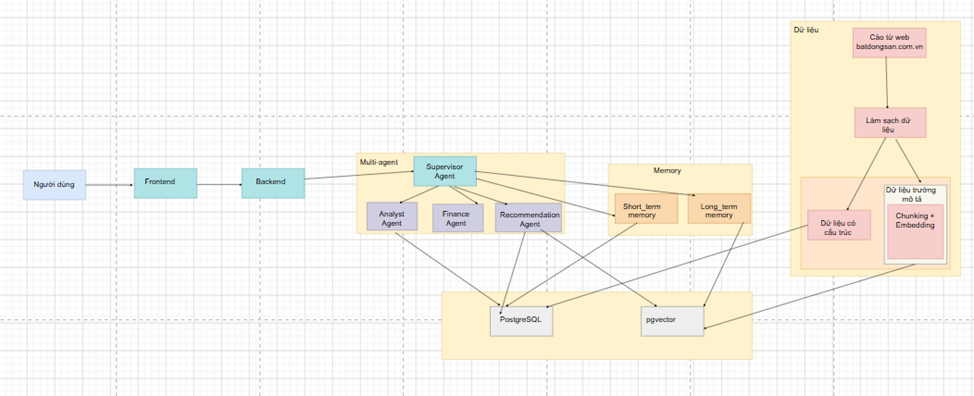
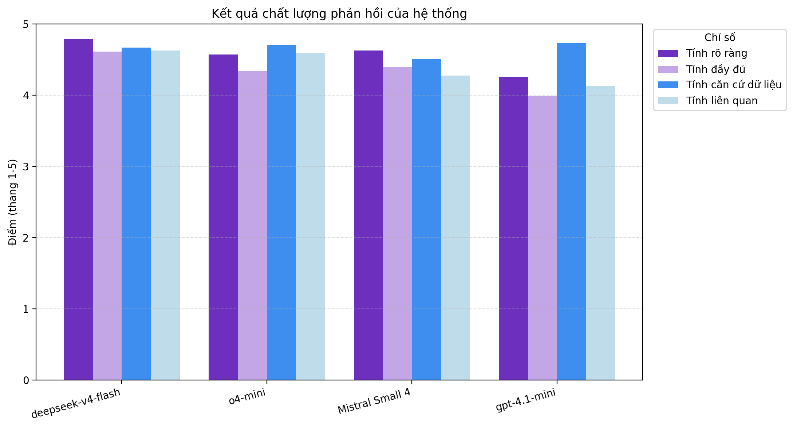

# Hệ thống ChatBot tư vấn Bất động sản và tài chính mua nhà

## 1. Giới thiệu
Hệ thống Chatbot tư vấn bất động sản và tài chính mua nhà tại Hà Nội được xây dựng nhằm hỗ trợ người dùng tra cứu, phân tích và tìm kiếm, tư vấn tài chính bất động sản thông qua ngôn ngữ tự nhiên. Hệ thống cung cấp cho người dùng lựa chọn một trong bốn mô hình ngay trên giao diện Chatbot như gpt-4.1-mini, o4-mini, deepseek v4 flash và mistral small 4

| Tiêu chí | GPT-4.1 mini | o4-mini | DeepSeek V4 Flash | Mistral Small 4 |
|----------|--------------|---------|-------------------|-----------------|
| **Loại mô hình** | Mô hình GPT tổng quát | Mô hình suy luận | Mô hình ngôn ngữ tối ưu chi phí | Mô hình ngôn ngữ nhỏ gọn, tối ưu cho tác vụ phổ thông |
| **Khả năng suy luận** | Khá tốt | Rất tốt trong các tác vụ cần suy luận nhiều bước | Khá, phù hợp với các câu hỏi đơn giản đến trung bình | Khá, suy luận nhiều bước ở mức trung bình |
| **Tốc độ phản hồi** | Khá nhanh | Trung bình (cần thời gian suy luận) | Khá nhanh với các tác vụ đơn giản | Khá nhanh đối với các tác vụ thông thường |

## 2. Kiến trúc hệ thống

| Tác tử | Vai trò | 
|--------|---------|
| **Supervisor Agent** | Trực tiếp tiếp nhận yêu cầu từ người dùng, phân tích ý định, lựa chọn tác nhân chuyên môn phù hợp, tổng hợp kết quả và trả kết quả cuối cùng cho người dùng | 
| **Analyst Agent** | Xử lý các yêu cầu liên quan đến thống kê, phân tích dữ liệu, so sánh thị trường và trực quan hóa dữ liệu bất động sản| 
| **Finance Agent** | Xử lý các yêu cầu tư vấn tài chính mua bất động sản, bao gồm tính toán khả năng vay, khoản trả góp, tỷ lệ vay và đánh giá mức độ an toàn tài chính | 
| **Recommendation Agent** | Xử lý các yêu cầu tìm kiếm và đề xuất tin đăng bất động sản, kết hợp lọc theo điều kiện cấu trúc với tìm kiếm ngữ nghĩa theo nội dung mô tả | 

Tính năng chính

| Nhóm | Mô tả |
|------|-------|
| **Phân tích & thống kê** | Giá trung bình, ranking quận/phường, phân bố, xu hướng theo thời gian; sinh biểu đồ (bar, line, pie, histogram, stacked bar…). |
| **Tư vấn tài chính** | Tính khoản vay & ngân sách tối đa, trả góp/tháng, LTV, tổng lãi; so sánh kịch bản vay theo thời hạn/lãi suất; tính lãi suất hỗn hợp
| **Tìm kiếm, gợi ý tin đăng** | Tìm BĐS theo quận/phường, giá, diện tích, số phòng, loại hình, tiện ích bằng tìm kiếm ngữ nghĩa + rerank. |
| **Bộ nhớ hội thoại** | Ngắn hạn (giữ ngữ cảnh theo lượt) và dài hạn (ghi nhớ sở thích & hồ sơ tài chính của người dùng). |
| **Tài khoản & phân quyền** | Đăng ký/đăng nhập, phân quyền `user` / `admin`. |
| **Dashboard quản trị** | Thống kê người dùng, phiên chat, model sử dụng, đánh giá like/dislike. |

---

## 3. Cấu trúc thư mục

```
KLTN_ChatBot/
├── backend/                      # FastAPI            
│
├── src/                          
│   ├── agents/                   #   Supervisor + 3 sub-agent
│   ├── prompts/                  #   System prompt từng agent
│   ├── tools/                                               
│   ├── memory/                   #   short_term memory, long_termemory
│   ├── llm/                     
│   └── utils/                    
│
├── rag/                          # Pipeline RAG
│   ├── prepare.py                #   Sinh mô tả tin đăng
│   ├── embedding.py              #   Embedding + kết nối pgvector
│   ├── index.py                  #   Index chunks vào vector store
│   └── descriptions_clean_1.json #   Dữ liệu mô tả đã làm sạch
│
├── data/                         # Dữ liệu & DB
│   ├── crawl_data.ipynb          #   Crawl dữ liệu BĐS
│   ├── processing_data.ipynb     #   Làm sạch dữ liệu
│   ├── database.py               
│   ├── ingest_data.py            
│   └── data_clean.csv            #   Dữ liệu BĐS đã làm sạch
│
├── configs/                      # Cấu hình
├── label/chart_labels.yaml      
│
├── frontend/                     # Giao diện 
│
├── evaluation/                   # Đánh giá chất lượng (LangSmith)
│   ├── dataset_e2e.py            #   Bộ câu hỏi đánh giá (51 case)
│   ├── base_eval.py              #   Khung chạy đánh giá
│   ├── evaluators_strict.py      #   Bộ chấm điểm (4 tiêu chí)
│   ├── run_*_eval.py             #   Chạy eval theo từng model
│   ├── export_eval_metrics.py    #   Xuất số liệu → evaluation_metrics.json
│   ├── plot_eval_metrics.py      #   Vẽ biểu đồ so sánh → charts/
│   └── charts/grouped_bar.png
│
├── tests/                        # Kiểm thử — 120 case
│
├── docker/init-db.sql           
├── .github/workflows/ci.yml      # CI/CD: lint → test → build → deploy
├── docker-compose.yml            
├── Dockerfile                    
├── pyproject.toml / uv.lock      
├── pytest.ini                    
└── README.md
```

---

## 4. Kết quả đánh giá

Hệ thống được đánh giá theo phương pháp LLM-as-judge với **4 tiêu chí** (thang điểm 1–5):

- **Tính căn cứ dữ liệu** (groundedness): Tính căn cứ dữ liệu đánh giá mức độ câu trả lời dựa trên dữ liệu thực tế được truy xuất từ các công cụ của hệ thống.
- **Tính liên quan** (relevance): Tính liên quan đánh giá câu trả lời có đi đúng trọng tâm yêu cầu của người dùng hay không
- **Tính đầy đủ** (completeness): Tính đầy đủ đánh giá câu trả lời có bao phủ đầy đủ các yêu cầu trong câu hỏi của người dùng hay không
- **Tính rõ ràng** (clarity): Tính rõ ràng đánh giá chất lượng trình bày của câu trả lời.

Kết quả so sánh giữa các mô hình LLM (thang 1–5) được chấm bởi GPT-4.1

| Mô hình | Căn cứ dữ liệu | Liên quan | Đầy đủ | Rõ ràng | 
|---------|:---:|:---:|:---:|:---:|
| **DeepSeek V4 Flash** | 4.67 | 4.63 | 4.61 | 4.78 | 
| **o4-mini** | 4.70 | 4.59 | 4.33 | 4.57 | 
| **Mistral Small 4** | 4.51 | 4.28 | 4.39 | 4.63 | 
| **GPT-4.1-mini** | 4.75 | 4.14 | 4.01 | 4.28 | 



---

Kiểm thử (Testing)

Hệ thống có **120 test case**. Test case: [tests/TestCases.xlsx](tests/TestCases.xlsx).

- Số lượng test: 120
- Pass/Fail: 120/0

---
Phản hồi của người dùng: 4.5/5 
